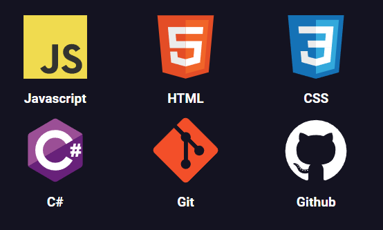

#   **Greetings👋, I'm Jorge A. Macias Z**

Student of  Computer Engineering at University of Guadalajara (CUCOSTA)

## **About Me**

I'm a self-taught programmer, I love to improve my knowledge and talk about new features with my friends/partners.

## **My skillset**

<section align="center">
    
</section>

## **I'm currently interested on learn**

- Web development **(backend)**
- Desktop development **(C# forms)**
- github workflows **(CI/CD)**
- Mobile development **(Flutter or Android)**
- Networking

## **Profile statistics**

